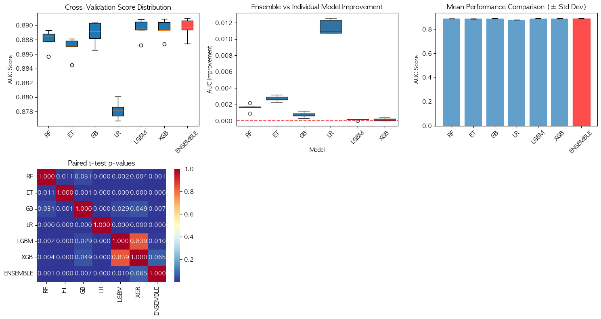
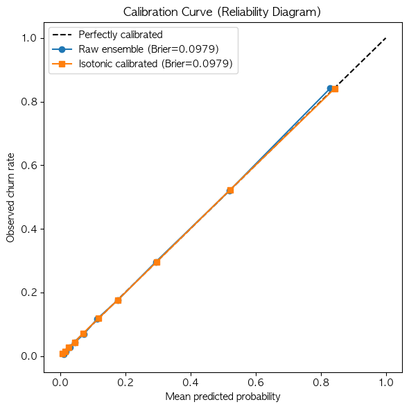
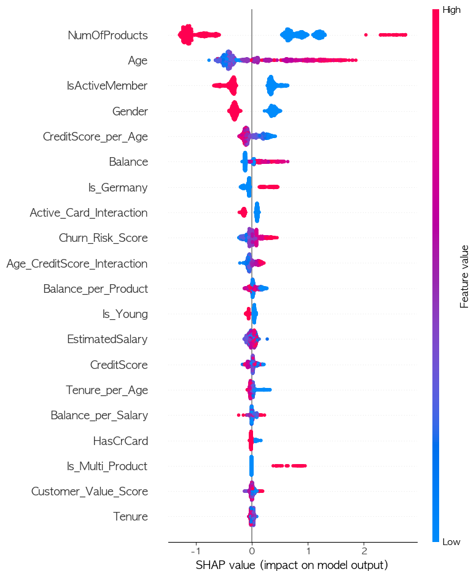

# Bank Customer Churn Prediction

[](https://github.com/0se0/hw2/actions/workflows/ci.yml)

Predict which bank customers will churn, and find out honestly how much an
ensemble actually adds over a single tuned model. Out-of-fold (OOF) training of
six models, a blended ensemble, and an evaluation that avoids the usual
optimistic shortcuts.

Data: Kaggle *Binary Classification with a Bank Churn Dataset*
(165,034 train rows, 110,023 test rows, 21% churn). The data is not included
in this repo.

## TL;DR

- **Ensemble AUC 0.8896** (5-fold, nested-CV score, ±0.0013) on a dataset that
  is close to saturated: every tuned boosting model lands at 0.8889–0.8895.
- **A single tuned LightGBM (0.8895) is statistically indistinguishable from the
  6-model ensemble** under a corrected significance test (p = 0.11). The
  ensemble beats LR, ExtraTrees, RandomForest and GradientBoosting, but for
  serving, one LightGBM is within 0.0001 AUC while running one model family
  instead of six.
- Several "obvious" improvements were checked and **did not help**: Optuna tuning
  (+0.0001–0.0012), probability calibration (already calibrated, Brier 0.0979),
  stacking (no better than a weighted blend). They're documented below rather
  than hidden.

## Results

5-fold OOF AUC on the real data. "Default" and "tuned" are 3-fold CV scores from
the hyperparameter search; the last column is the 5-fold score used for
everything else.

| Model | Default (3-fold) | Optuna-tuned (3-fold) | 5-fold AUC |
|-------|------------------|-----------------------|------------|
| Logistic Regression | 0.8781 | 0.8782 | 0.8782 ± 0.0011 |
| Extra Trees | 0.8858 | 0.8870 | 0.8869 ± 0.0013 |
| Random Forest | 0.8877 | 0.8878 | 0.8879 ± 0.0013 |
| Gradient Boosting | not tuned | not tuned | 0.8889 ± 0.0014 |
| LightGBM | 0.8892 | 0.8893 | 0.8895 ± 0.0013 |
| XGBoost | 0.8891 | 0.8894 | 0.8895 ± 0.0012 |
| **Weighted blend (nested CV)** | | | **0.8896 ± 0.0013** |

Blend weights: LightGBM 36.7%, XGBoost 35.6%, GradientBoosting 17.6%,
RandomForest 5.3%, ExtraTrees 4.8%, LogisticRegression 0%.

### Is the ensemble really better?

Scoring a blend on the same predictions its weights were fit on is optimistic,
and 5-fold scores are not independent (training sets overlap), which makes a
naive paired t-test too generous. So the blend is scored with **nested CV**
(weights for each fold fit on the other four), and significance is reported
three ways: naive t-test, **Nadeau–Bengio corrected t-test**, and a **paired
bootstrap** over the 165k OOF rows.

| Method | Fold-mean AUC |
|---|---|
| Weighted blend, in-sample (biased) | 0.8897 |
| **Weighted blend, nested CV (fair)** | **0.8896** |
| Stacking (logistic-regression meta-model) | 0.8891 |
| Equal-weight average (no fitting) | 0.8889 |
| Best single model (LightGBM) | 0.8895 |

| Ensemble vs. | AUC gain | Naive p | Corrected p | Bootstrap 95% CI |
|---|---|---|---|---|
| Logistic Regression | +0.0114 | <0.0001 | <0.0001 | [+0.0107, +0.0121] |
| Extra Trees | +0.0027 | 0.0001 | 0.0004 | [+0.0023, +0.0030] |
| Random Forest | +0.0018 | 0.0008 | 0.0036 | [+0.0015, +0.0021] |
| Gradient Boosting | +0.0007 | 0.0086 | 0.0328 | [+0.0005, +0.0009] |
| LightGBM | +0.0001 | 0.0382 | **0.1121** | [+0.00004, +0.0002] |
| XGBoost | +0.0001 | 0.1128 | **0.2483** | [+0.00004, +0.0002] |

The blend clearly beats the weaker models. Against LightGBM and XGBoost the
corrected test cannot reject "no difference", and the bootstrap gap
(~0.0001 AUC) is real but practically irrelevant.



## Repo layout

```
src/churn/
  features.py    input validation + feature engineering (train-fitted state passed in)
  models.py      model zoo + default hyperparameters
  ensemble.py    OOF training, blend-weight search, nested-CV blend score
  stats.py       corrected resampled t-test, paired bootstrap
  metrics.py     rank-based AUC (verified against sklearn)
  train.py       CLI: train, evaluate, write submission + model artifact
  predict.py     CLI: score new customers with the saved artifact
params/best_params.json   tuned hyperparameters (from the Optuna run)
tests/                    pytest suite (23 tests)
.github/workflows/ci.yml  runs the tests on every push (Python 3.10 and 3.12)
notebooks/ML_h2.ipynb     exploratory analysis: EDA, Optuna, SHAP, calibration
assets/                   charts used in this README
```

## Quickstart

```bash
pip install -r requirements.txt
# put train.csv and test.csv in ./data (or pass --data-dir)
PYTHONPATH=src python -m churn.train --data-dir data --out-dir artifacts
PYTHONPATH=src python -m churn.predict --model artifacts/model.joblib \
    --input data/test.csv --output artifacts/preds.csv
pip install pytest && python -m pytest
```

`train` writes `submission.csv`, `model.joblib` (the 30 fold models + blend
weights + feature state, ~0.9 GB, git-ignored) and `metrics.json`. `predict`
reproduces the training-time test predictions (max difference 4e-8 on the
real test set; also covered by a test). Input is validated first: missing
columns, unseen Geography/Gender values, missing numerics and non-positive Age
raise a clear error instead of being silently scored (an unseen country used
to be mapped to NaN and filled with 0, i.e. treated as France).

Tested with Python 3.13 / scikit-learn 1.7–1.9 / LightGBM 4.7 / XGBoost 3.3–3.4;
the minimum versions in `requirements.txt` are not individually tested.

Notes on the packaged pipeline: Optuna tuning is not re-run by default (the
tuned parameters live in `params/best_params.json`), and the blend-weight
search uses a cheaper differential-evolution setting (`maxiter=100`,
`popsize=10`) than the notebook (`300`/`15`). A full run on the real data took
about 22 minutes on a laptop (mostly GradientBoosting fits), versus roughly 80
minutes for the notebook with tuning and the full weight search.

Checked against the notebook on the real data: the per-fold AUCs of all six
models match to 4 decimals, the nested blend score is 0.8896 in both, and the
test predictions rank-correlate at 0.9999999 with the notebook's submission
(the blend weights differ slightly because of the cheaper search).

## Methodology and decisions

**Out-of-fold training.** Every model is trained on each of 5 stratified
folds. OOF predictions cover the whole training set, so blend weights are fit
on ~5x more held-out data than a single split would give, and test
predictions are the average of the 5 fold models.

**Blend-weight search.** AUC is a step function of the weights, so its
gradient is ~0 almost everywhere and SLSQP simply returned its starting point
(verified). Differential evolution needs no gradient and finds real
improvements.

**Feature engineering (12 → 27 features).** Ratio, interaction and flag
features plus a churn-risk score. One bug fixed along the way: `Is_High_Value`
used each dataset's own Balance 80th percentile, so train and test used
different cutoffs. The threshold is now fit on train and passed in; a test
asserts a row's features don't depend on the rows it's scored with.

**Hyperparameter tuning (Optuna, notebook).** TPE sampler, 3-fold CV AUC, up to
25 trials or 180 s per model, for RF / ExtraTrees / LR / LightGBM / XGBoost.
sklearn's `GradientBoostingClassifier` was left out: no early stopping and
single-threaded, so each trial is far more expensive. Gains were small
(0.0001–0.0012) because the dataset is near saturation.

**Class imbalance (21% churn).** `class_weight='balanced'` (XGBoost:
`scale_pos_weight`) vs. default, 3-fold CV:

| Model | AUC default | AUC balanced | F1 default | F1 balanced |
|-------|-------------|--------------|------------|-------------|
| Random Forest | 0.8877 | 0.8876 | 0.6241 | 0.6507 |
| Extra Trees | 0.8869 | 0.8867 | 0.6184 | 0.6427 |
| Logistic Regression | 0.8782 | 0.8788 | 0.6143 | 0.6220 |
| LightGBM | 0.8892 | 0.8890 | 0.6340 | 0.6433 |
| XGBoost | 0.8893 | 0.8892 | 0.6331 | 0.6429 |

F1 at a 0.5 threshold improves by up to +0.027 at essentially no AUC cost. It
is not used in the pipeline because the target metric is AUC (ranking), which
`class_weight` doesn't change; it would be the right switch if the goal were a
hard "call / don't call" decision.

**Calibration.** Brier score and a reliability diagram on the OOF ensemble
probabilities, with isotonic regression (fit per fold, no leakage) as the
candidate fix. Brier is 0.0979 before and after: the blend is already
well-calibrated, so no calibration layer is applied.



**Explainability (SHAP).** TreeSHAP on the best single model (LightGBM),
2,000-row sample. Top features: NumOfProducts, Age, IsActiveMember, Gender,
CreditScore_per_Age. Unlike impurity importance, SHAP shows direction:
`NumOfProducts` is non-monotonic (churn is 34.7% with 1 product, 6.0% with 2,
88% with 3–4), and the plot reflects that.



## Caveats

- **Tuning isn't bit-for-bit reproducible in the notebook.** Optuna studies are
  time-capped, so the number of completed trials varies with machine load;
  the 4th decimal of some AUCs and the exact blend weights shift between runs.
  The packaged pipeline avoids this by reading fixed parameters from JSON.
- **The bootstrap ignores training variance** (it resamples evaluation rows of
  one set of trained models). The Nadeau–Bengio test covers that but has only
  4 degrees of freedom, hence little power; both are shown for that reason.
- **Nested-CV blending shares stacking's mild leak.** OOF predictions used to
  fit one fold's weights came from models that had seen that fold's rows. The
  comparison between blend and stacking stays fair, but both are slightly
  optimistic versus a fully separate holdout.
- CatBoost was not installed where this was run; it is picked up automatically
  if available.

## Tech

Python, scikit-learn, LightGBM, XGBoost, Optuna, SHAP, SciPy, pandas, NumPy,
joblib, pytest.
