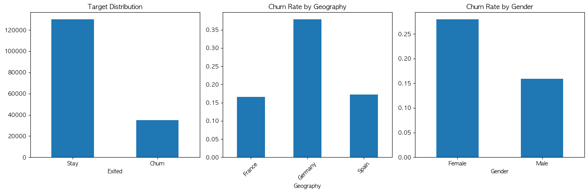
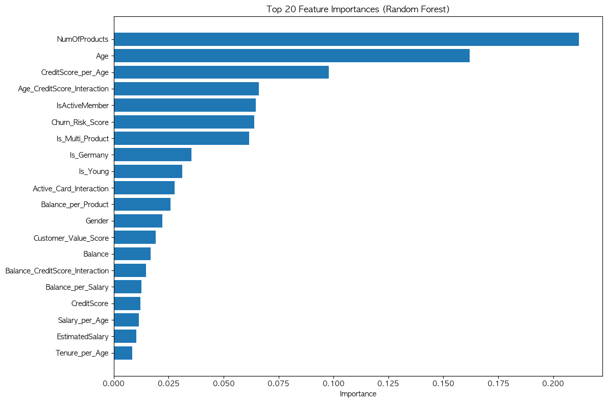

# Bank Customer Churn Prediction

Binary classification to predict whether a bank customer
will churn, using an out-of-fold (OOF) ensemble of tree models,
linear models, and gradient boosting libraries.

## Results (5-fold OOF, real dataset — 165,034 train rows, Optuna-tuned models)

| Model | Default CV AUC | Optuna-tuned CV AUC | Final OOF AUC |
|-------|----------------|----------------------|---------------|
| Logistic Regression | 0.8781 | 0.8782 | 0.8782 ± 0.0011 |
| Extra Trees | 0.8858 | 0.8870 | 0.8869 ± 0.0013 |
| Random Forest | 0.8877 | 0.8878 | 0.8879 ± 0.0013 |
| Gradient Boosting | — (not tuned, see below) | — | 0.8889 ± 0.0014 |
| LightGBM | 0.8892 | 0.8893 | 0.8895 ± 0.0013 |
| XGBoost | 0.8891 | 0.8894 | 0.8895 ± 0.0012 |
| **Ensemble (weighted blend)** | | | **0.8897 ± 0.0013** |

Optimal blend weights: LGBM 36.1% / XGB 36.1% / GB 17.9% / RF 5.3% / ET 4.7% / LR 0%
(a stacking meta-model was also tried and scored slightly lower — 0.8891 — so the
weighted blend was kept).

- 95% CI: [0.8886, 0.8908]
- Statistically significant improvement vs **5 of 6** individual models (p < 0.05);
  XGBoost was the one exception (p = 0.06) since Optuna tuning brought it almost
  level with the ensemble itself
- Predicted test churn rate: 21.12% (actual train churn rate: 21.16%)
- CatBoost was not installed in the environment this was run in, so it was skipped;
  installing it may push the ensemble slightly further.

## Hyperparameter Tuning (Optuna)

Instead of hand-picked hyperparameters, RF / ExtraTrees / LogisticRegression /
LightGBM / XGBoost are each tuned with [Optuna](https://optuna.org)'s TPE
(Tree-structured Parzen Estimator) sampler, maximizing 3-fold CV AUC (up to 25
trials or 180 seconds per model, whichever comes first). sklearn's
`GradientBoostingClassifier` is deliberately excluded from tuning — it doesn't
support early stopping and is single-threaded, so each trial is far more
expensive than for the other models; tuning it would dominate total runtime
for a marginal gain, so it keeps its hand-set defaults.

The gains here are modest (this dataset is close to saturated for these model
families — the previous manually-tuned parameters were already reasonable),
but the process itself (defining search spaces, choosing a budget, comparing
against a default-parameter baseline) is the point: RF/ExtraTrees/LightGBM/
XGBoost/LogisticRegression all improved or matched their default-parameter CV
AUC after tuning.

## Class Imbalance

Churn rate is 21%, a mild imbalance. AUC is largely insensitive to class
balance, so it's unlikely to move much either way — but a fixed 0.5-threshold
classification decision (as opposed to ranking) can still be biased toward
the majority ("stay") class. Checked directly: `class_weight='balanced'`
(XGBoost: equivalent `scale_pos_weight`) vs. default, evaluated via 3-fold CV
on OOF probabilities (RF/ExtraTrees/LightGBM/XGBoost/LogisticRegression;
`GradientBoostingClassifier`'s sklearn implementation doesn't support
`class_weight` at all, so it's excluded from this comparison specifically).

| Model | AUC (default) | AUC (balanced) | F1 (default) | F1 (balanced) |
|-------|---------------|-----------------|---------------|-----------------|
| Random Forest | 0.8879 | 0.8877 | 0.6235 | 0.6497 |
| Extra Trees | 0.8869 | 0.8867 | 0.6184 | 0.6427 |
| Logistic Regression | 0.8782 | 0.8788 | 0.6143 | 0.6220 |
| LightGBM | 0.8892 | 0.8890 | 0.6340 | 0.6433 |
| XGBoost | 0.8893 | 0.8892 | 0.6331 | 0.6429 |

Unlike the Optuna and calibration checks, this one comes back positive:
`class_weight='balanced'` improves F1 by up to +0.026 at a maximum AUC cost of
only -0.0003 — essentially free. It wasn't folded into the main pipeline
because this project's actual target metric is AUC-based ranking (the
Kaggle-style submission), and `class_weight` acts on the 0.5-threshold
decision, not the ranking that AUC measures — so there's nothing for the main
pipeline to gain from it here. If the goal shifted from a ranked probability
output to an actual binary decision (e.g. "who gets a retention call"),
turning this on would be the right move, and the numbers above already make
that case.

## Explainability (SHAP)

Random Forest's impurity-based feature importance is known to be biased toward
high-cardinality and correlated features. As a more principled alternative,
[SHAP](https://github.com/shap/shap) (`TreeExplainer`) is run on the
best-performing individual model by OOF AUC (LightGBM), computing Shapley
values on a 2,000-row sample of the training set.

**SHAP summary (LightGBM) — top 10 by mean |SHAP|:** NumOfProducts, Age,
IsActiveMember, Gender, CreditScore_per_Age, Balance, Is_Germany,
Active_Card_Interaction, Churn_Risk_Score, Age_CreditScore_Interaction.

This mostly agrees with the RF impurity-based ranking (both surface
NumOfProducts, Age, IsActiveMember as top drivers) but reorders several
mid-tier features and — unlike impurity importance — shows *direction*: e.g.
a high `NumOfProducts` pushes the prediction both strongly up and strongly
down depending on its value (customers with too many products churn more,
consistent with `Is_Multi_Product`'s effect), which a single importance
number can't express.

## Calibration

A model can rank customers well (high AUC) while still outputting probabilities
that don't match reality — e.g. saying "73% churn risk" for a group that
actually churns 50% of the time. This matters when the probability itself
drives a business decision (who gets a retention call), not just the ranking.

Checked via Brier score and a reliability diagram on the OOF ensemble
probabilities, with isotonic regression as a candidate fix (fit/applied per
fold on the same 5-fold split used everywhere else, so there's no leakage
into the calibration check itself):

| | Brier score |
|---|---|
| Raw ensemble | 0.0979 |
| Isotonic-calibrated | 0.0979 (no improvement) |

The reliability curve sits almost exactly on the diagonal already — the
weighted blend of tree models turned out to be well-calibrated on its own, so
no calibration layer was applied to the final predictions. This is a real
possible outcome of the check, not a shortcut: an ensemble average of several
well-fit models often self-calibrates even when individual members don't.

## What changed in the rework
- **Added LightGBM / XGBoost / CatBoost** to the model zoo (used if installed,
  skipped otherwise) alongside RF / ExtraTrees / GradientBoosting / LogisticRegression.
- **Out-of-fold (OOF) evaluation** instead of a single 80/20 train/val split:
  every model now produces predictions for the *entire* training set via
  5-fold CV, so ensemble weights are fit on ~5x more validation data and are
  far less likely to overfit to one particular split.
- **Fold-averaged test predictions (bagging)**: test predictions are the
  average of 5 fold-models per base model, instead of a single model fit on
  80% of the data — this lowers prediction variance on the leaderboard set.
- **Ensemble weight search replaced**: the old approach was a brute-force
  grid over 6 discrete weight values. AUC is a rank-based, non-smooth
  objective, so a gradient-based optimizer (SLSQP) was tried and verified to
  get stuck at its initial guess; `scipy.optimize.differential_evolution`
  (derivative-free) is used instead and empirically finds real improvements.
- **Stacking added as an alternative** to weighted blending: a logistic
  regression meta-model trained on OOF predictions, evaluated via its own
  CV, is compared against the weighted blend, and whichever wins is used.
- **Fixed a train/test leakage-style bug**: `Is_High_Value` used to threshold
  each dataset against its own `Balance` 80th percentile, so train and test
  used different, inconsistent cutoffs. The threshold is now computed once on
  train and reused for both.
- **Statistical significance testing consolidated**: the old notebook
  retrained every model a second time (via `cross_val_score`) just to run the
  paired t-tests. The rework reuses the per-fold AUCs already produced during
  OOF generation — same statistical test, no duplicate training.
- **Colab dependency removed from the core pipeline**: the notebook reads
  `train.csv`/`test.csv` from disk (or `CHURN_DATA_DIR`) when available, and
  only falls back to `google.colab.files.upload()`/`download()` when actually
  running in Colab, so it also runs locally or in any other Jupyter environment.
- **Model persistence**: final models, scaler, weights/meta-model, and the
  feature list are saved to `churn_ensemble_artifact.joblib` for reuse without
  retraining.
- **Optuna hyperparameter tuning**, a **class imbalance check**
  (`class_weight='balanced'` vs. default), **SHAP-based explainability**, and
  a **calibration check** (Brier score + reliability diagram, with isotonic
  regression as a candidate fix) added on top of the above — see the
  dedicated sections earlier in this file.

The rework was smoke-tested end-to-end on synthetic data first, then run on
the real dataset (`train.csv`: 165,034 rows, `test.csv`: 110,023 rows) to
produce the numbers above.

## Visualizations

**EDA — target/geography/gender churn rates**

**Feature importance (Random Forest, top 20)**

**Statistical comparison — CV score distributions, improvement over baselines, paired t-test p-values**

## Feature Engineering
Expanded from 12 → 27 features:
- Ratio features (Balance/Product, CreditScore/Age)
- Interaction features (Age × CreditScore)
- Binary flags (Is_Germany, Is_Senior, Is_Multi_Product)
- Churn Risk Score (composite indicator)

## Top Features (Random Forest impurity importance)
1. NumOfProducts (0.2083)
2. Age (0.1705)
3. CreditScore_per_Age (0.0904)

(see [Explainability (SHAP)](#explainability-shap) above for a less biased,
direction-aware ranking)

## Tech
Python, Scikit-learn, LightGBM, XGBoost, (CatBoost if installed), Optuna,
SHAP, SciPy, Pandas, NumPy, Matplotlib, Seaborn, Joblib
